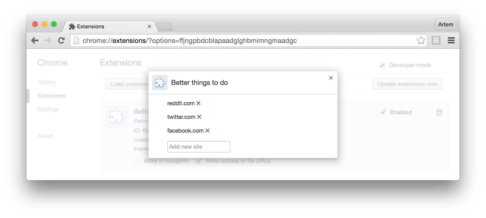
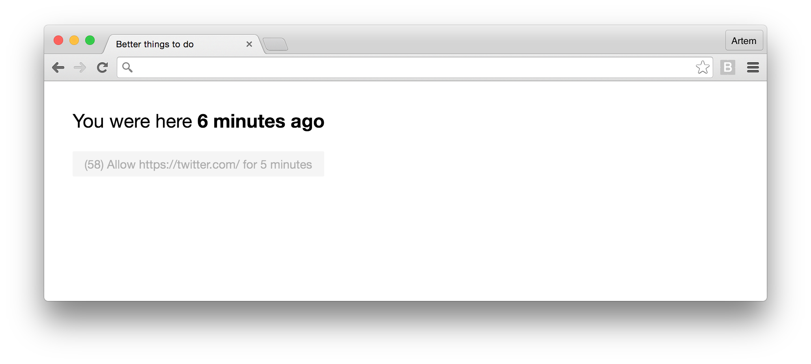

#### Better things to do

Dead simple Chrome extension to save up some time.

You add a website to the list and the extension asks you to wait for 60 seconds before visiting it. Timer stops if the tab is not active.



<br>



### Install

You can install from [Chrome store](https://chrome.google.com/webstore/detail/better-things-to-do/begggblpkegcnammjagcmplfnpopocla/) or drag `better-things-to-do.crx` to `chrome://extensions/`. Use `npm run publish` to rebuild `.crx` file.

### Prevent from disabling

On OS X, at `/Library/Managed\ Preferences/$USER` create `com.google.Chrome.plist` with:

```xml
<?xml version="1.0" encoding="UTF-8"?>
<!DOCTYPE plist PUBLIC "-//Apple//DTD PLIST 1.0//EN" "http://www.apple.com/DTDs/PropertyList-1.0.dtd">
<plist version="1.0">
<dict>
	<key>ExtensionInstallForcelist</key>
	<array>
		<string>begggblpkegcnammjagcmplfnpopocla;https://clients2.google.com/service/update2/crx</string>
	</array>
</dict>
</plist>
```
